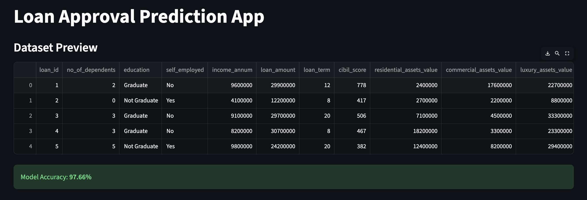
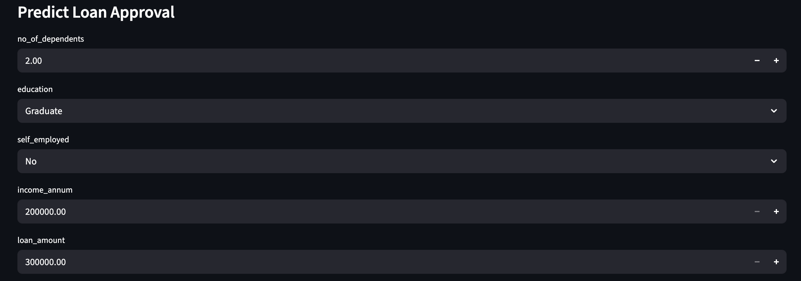
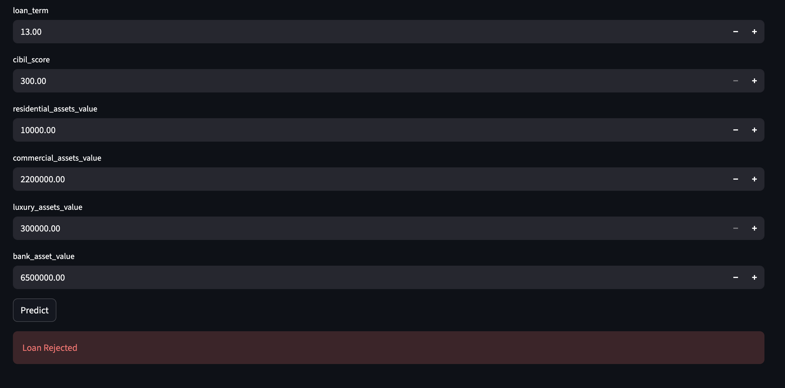

# 🏦 Loan Default Predictor

> End-to-end ML pipeline to predict loan default risk with robust preprocessing, hyperparameter tuning, and production-ready deployment.


---

## 📌 Problem Statement

Loan defaults are a major financial risk for banks and lending institutions. Manual evaluation is slow, inconsistent, and prone to human bias. This project builds an automated ML system that predicts whether a loan applicant is likely to default — enabling faster, data-driven decisions.

---

## 🎯 Results

| Metric | Score |
|---|---|
| Accuracy | ~97.6% |
| ROC-AUC | ~1.0 |
| Model | Random Forest Classifier |

---

## 🔧 Project Workflow
```
Raw Data → EDA → Preprocessing → Model Training → Hyperparameter Tuning → Evaluation → Deployment
```

### 1. 📊 Data Analysis (EDA)
- Analyzed feature distributions, missing values, skewness, and outliers
- Used insights to guide all preprocessing decisions

### 2. ⚙️ Preprocessing & Feature Engineering
- Skewness correction using **Yeo-Johnson transformation**
- Outlier removal using **IQR method**
- Categorical feature encoding
- Numerical feature scaling

### 3. 🤖 Model Training
- Trained a **Random Forest Classifier** for robustness on tabular data

### 4. 🔍 Hyperparameter Optimization
- Used **Optuna** to tune key hyperparameters for best generalization

### 5. 🚀 Deployment
- **FastAPI** for model inference endpoint
- **Streamlit** for interactive web app
- **Docker** for containerized deployment
- **GitHub Actions** for CI/CD pipeline

---

## 🛠️ Tech Stack

| Category | Tools |
|---|---|
| Language | Python |
| ML | Scikit-learn, Random Forest, Optuna |
| Data | Pandas, NumPy |
| Visualization | Matplotlib, Seaborn |
| Deployment | FastAPI, Streamlit, Docker |
| CI/CD | GitHub Actions |

---

## 📂 Project Structure
```
Loan_Default_Predictor/
├── .github/workflows/    # CI/CD pipeline
├── data/                 # Dataset
├── code.ipynb            # EDA + Model training notebook
├── Api.py                # FastAPI inference endpoint
├── app.py                # Streamlit web app
├── model.pkl             # Trained model
├── dockerfile            # Docker configuration
├── requirements.txt      # Dependencies
└── test_main.py          # Unit tests
```

---

## ⚡ How to Run

### Option 1 — Run Streamlit App
```bash
git clone https://github.com/UchiaObito004/Loan_Default_Predictor.git
cd Loan_Default_Predictor
pip install -r requirements.txt
streamlit run app.py
```

### Option 2 — Run with Docker
```bash
docker build -t loan-default-predictor .
docker run -p 8501:8501 loan-default-predictor
```

### Option 3 — FastAPI Endpoint
```bash
uvicorn Api:app --reload
# Visit http://127.0.0.1:8000/docs
```

---

## 📸 Screenshots

### 📊 Dataset Preview & Model Accuracy


### 📝 Input Form


### 🎯 Prediction Result


---

## 🙋‍♂️ Author

**Bhushan Verma**  
B.Tech AI & Data Science | PIET (2023–2027)  
[](https://linkedin.com/in/bhushan-verma-420391385)
[](https://github.com/UchiaObito004)
